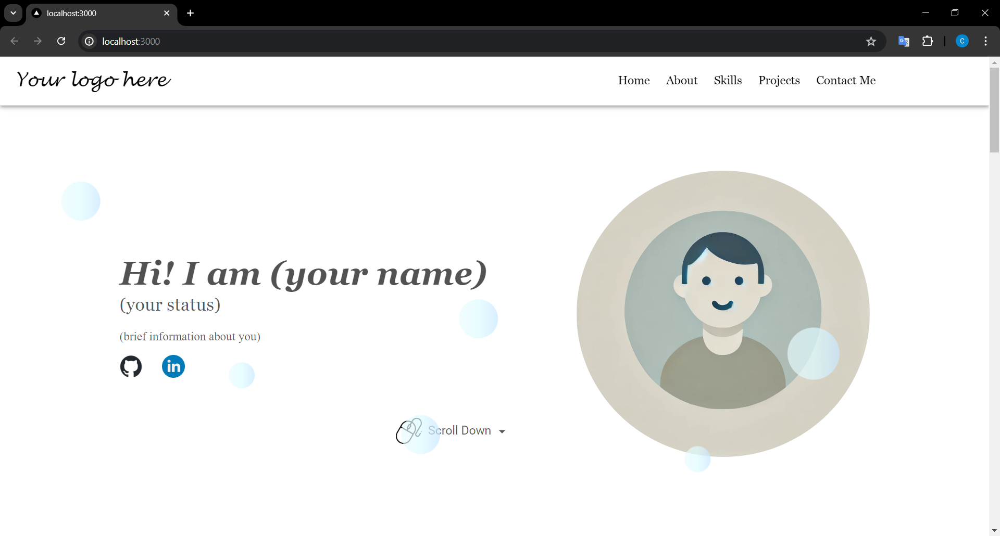
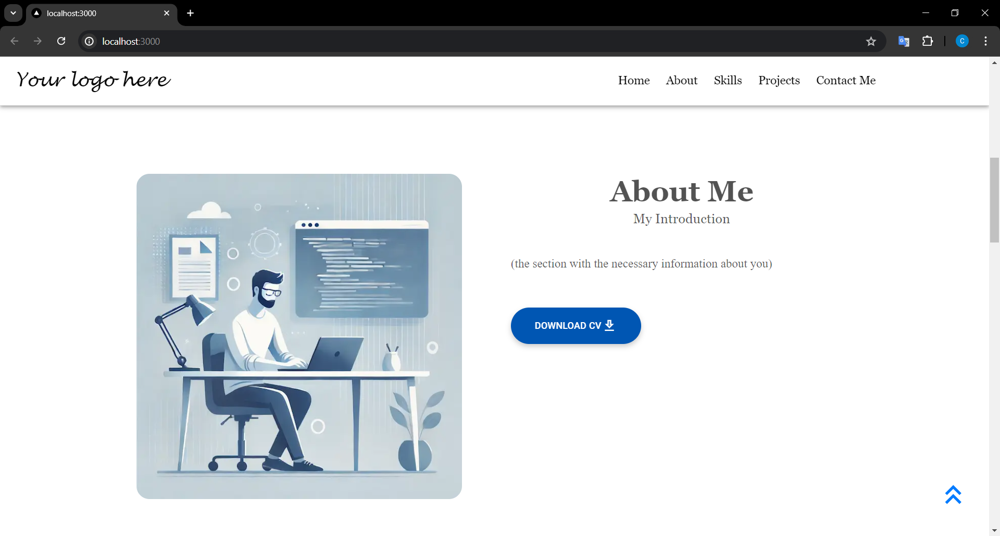
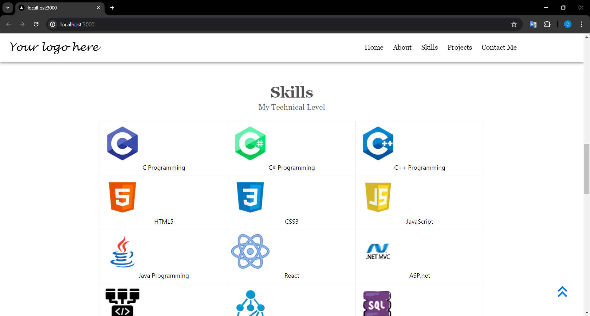
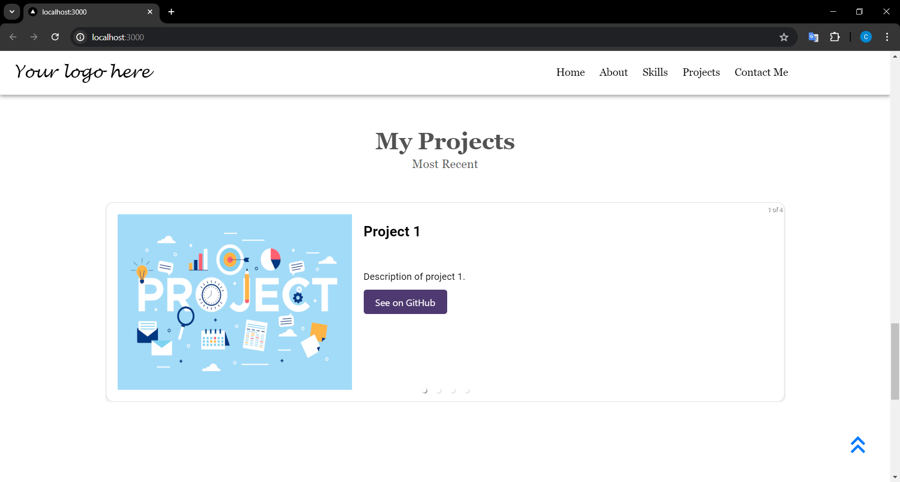
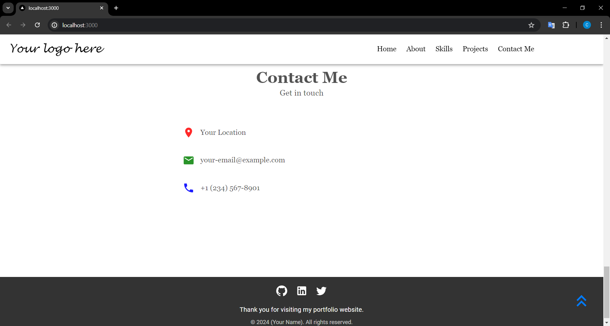

# My Portfolio Project

A modern and responsive portfolio website built with React, Next.js, and MUI. This project showcases your profile photo, brief description, detailed about me section, skills, projects, and contact information.

## Features

- Dynamic bubble animation on the Home page with particle effects.
- Fully responsive design for all devices.
- External CSS for consistent styling.
- Downloadable CV from the About section.
- Project carousel to display recent projects with GitHub links.
- Social media icons and contact information in the Footer section.

## Technologies Used

- React
- Next.js
- MUI (Material-UI)
- CSS Modules

## Setup and Usage

1. Clone the repository:
   ```sh
   git clone https://github.com/cemsrdgn/MyPortfolio.git
   cd my-portfolio

2.Install dependencies:

    npm install

3.Run the development server:

    npm run dev

4.Open http://localhost:3000 to view it in the browser.

## Screenshots

### Home Page


### About Page


### Skills Page


### Projects Page


### Contact Page


   
##Development Notes
 - The bubble animation was implemented using CSS keyframes and JavaScript for dynamic behavior.
 - The project structure is organized with separate components and styles for better maintainability.

   
##Contributing
 - Contributions are welcome! Please fork the repository and create a pull request with your changes.
